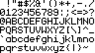

# 6x9 "monogram" monochrome bitmap font for rendering

Monogram is a compact bitmap font, designed to be legible in small or large resolutions.

## Showcase




## Encoding

Every basic latin character (`U+0000` ~ `U+007F`) in the font is encoded row-wise in 9 bytes in [font_monogram.h](font_monogram.h).

The least significant bit of each byte corresponds to the first pixel in a row.

E.g.: The character `'A'` (0x41 / 65) is encoded as `{ 0x0E, 0x11, 0x11, 0x11, 0x1F, 0x11s, 0x11, 0x00, 0x00}`

```
0x0E => 0000 1110 => .XXX....
0x11 => 0001 0001 => X...X...
0x11 => 0001 0001 => X...X...
0x11 => 0001 0001 => X...X...
0x1F => 0001 1111 => XXXXX...
0x11 => 0001 0001 => X...X...
0x11 => 0001 0001 => X...X...
0x00 => 0000 0000 => ........
0x00 => 0000 0000 => ........
```

> Note: The 2 most significant bits of each byte are always `0x00`. So, you can assume that all characters are 6 pixels wide.

## Renderer

To visualize the font, a simple renderer is included in [`render.c`](render.c)

```
$ gcc render.c -o render
$ ./render 65
 XXX
X   X
X   X
X   X
XXXXX
X   X
X   X


```

## Thanks

This repository only exists thanks to:

- https://github.com/dhepper/font8x8
- https://datagoblin.itch.io/monogram

## Projects using this rendering font

- https://github.com/litecanvas/plugin-pixel-font - a plugin to display retro pixel fonts in the Litecanvas engine.

## LICENSE

This repository is (un)licensed under [Public Domain](LICENSE), so take it and do whatever you want with it. Credits are not required but much appreciated.
